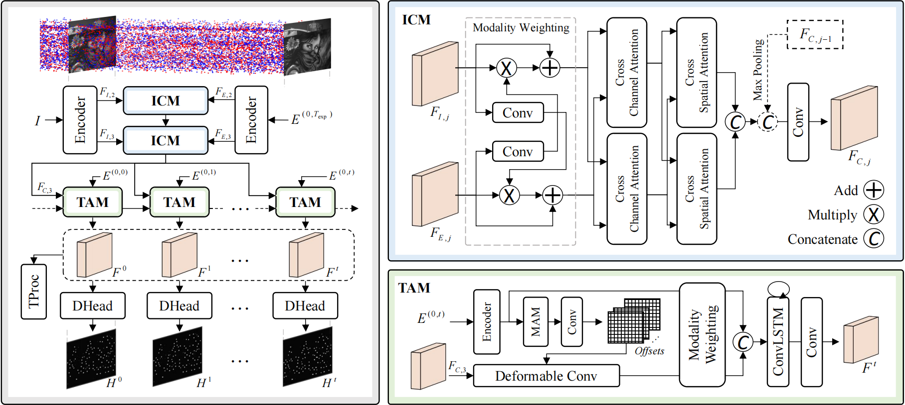

# Towards Robust Keypoint Detection and Tracking: A Fusion Approach with Event-Aligned Image Features

<p align="center">
  
</p>

This is the Pytorch implementation of the RA-L 2024 paper [Towards Robust Keypoint Detection and Tracking: A Fusion Approach with Event-Aligned Image Features](https://ieeexplore.ieee.org/abstract/document/10629077). 

```bibtex
@article{wang2024towards,
  title={Towards Robust Keypoint Detection and Tracking: A Fusion Approach with Event-Aligned Image Features},
  author={Wang, Xiangyuan and Yu, Huai and Yu, Lei and Yang, Wen and Xia, Gui-Song},
  journal={IEEE Robotics and Automation Letters},
  year={2024},
  publisher={IEEE}
}
```


## Extreme Corners Dataset
**Baidu Netdisk**: https://pan.baidu.com/s/17W4hOlsyePy-D4sd6Q3aIA  **code**: 0620

The dataset is only used for testing. It should look like this:
   ```
   ${DATASET_ROOT}
      -- Normal
          |-- normal_1_1.aedat4
          |-- normal_1_2.aedat4
          |-- normal_2_1.aedat4
          ...
      -- Blur
      -- Dark
      -- Over
   ```


## Results
<p align="center">
  
</p>
<p align="center">
  
</p>
<p align="center">
  
</p>


## Prepare the Environment
### 1. Install the [Metavision SDK](https://docs.prophesee.ai/stable/installation/index.html) for Event Simulator

### 2. Install Python library
```
conda create -n ff_kdt python==3.8
conda activate ff_kdt
```


## References
[1] C. Philippe, P. Etienne, S. Amos, and L. Vincent, “Long-lived accurate keypoints in event streams,” arXiv preprint arXiv: 2209.10385, 2022.

[2] N. Messikommer, C. Fang, M. Gehrig, and D. Scaramuzza, “Data-driven feature tracking for event cameras,” in Proceedings of the IEEE/CVF Conference on Computer Vision and Pattern Recognition, 2023, pp. 5642–5651.

[3] A. W. Harley, Z. Fang, and K. Fragkiadaki, “Particle video revisited: Tracking through occlusions using point trajectories,” in European Conference on Computer Vision, 2022, pp. 59–75.


