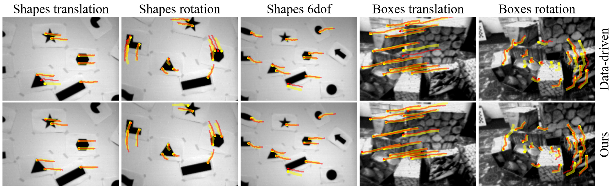

# Towards Robust Keypoint Detection and Tracking: A Fusion Approach with Event-Aligned Image Features

<p align="center">
  
</p>

This is the Pytorch implementation of the RA-L 2024 paper [Towards Robust Keypoint Detection and Tracking: A Fusion Approach with Event-Aligned Image Features](https://ieeexplore.ieee.org/abstract/document/10629077). 

Our method is a self-supervised approach that combines image and event, consisting of two main parts: \\(1) **keypoint** detector; （2）**Any point** tracker. 

```bibtex
@article{wang2024towards,
  title={Towards Robust Keypoint Detection and Tracking: A Fusion Approach with Event-Aligned Image Features},
  author={Wang, Xiangyuan and Yu, Huai and Yu, Lei and Yang, Wen and Xia, Gui-Song},
  journal={IEEE Robotics and Automation Letters},
  year={2024},
  publisher={IEEE}
}
```


## Extreme Corners Dataset
**Baidu Netdisk**: https://pan.baidu.com/s/17W4hOlsyePy-D4sd6Q3aIA  **code**: 0620

The dataset is only used for testing. It should look like this:
   ```
   ${DATASET_ROOT}
      -- Normal
          |-- normal_1_1.aedat4
          |-- normal_1_1.mp4
          |-- normal_1_2.aedat4
          |-- normal_1_2.mp4
          ...
      -- Blur
      -- Dark
      -- Over
   ```
.aedat4 is the actual data file, and .mp4 is only used for data visualization.


## Results
### 1. Results on Extreme Corners Dataset
<p align="center">
  
</p>
<p align="center">
  
</p>

### 2. Results on Event Camera Dataset
<p align="center">
  
</p>


## Prepare Environment
### 1. Install the [Metavision SDK](https://docs.prophesee.ai/stable/installation/index.html) for Event Simulator (Only for training)

### 2. Install library
Ensure that CUDA is available before installation. 
```
conda create -n ff_kdt python==3.8
conda activate ff_kdt

pip install torch==1.11.0+cu113 torchvision==0.12.0+cu113 torchaudio==0.11.0 --extra-index-url https://download.pytorch.org/whl/cu113
pip install pytorch-lightning==1.8.6

pip install -U openmim
mim install mmcv==2.1.0

bash install.sh
```

## Evaluation
Download the Extreme Corners Dataset and place the checkpoint in the ./checkpoints/ folder first. 

Pretrained models can be downloaded from [Baidu Netdisk](https://pan.baidu.com/s/10v0HHstRxRA_GTo5Ne4Bjg?pwd=seaq). 

```
cd ./eval

python eval_from_aedat4_high_freq.py --file_dir YOUR_DATASET_ROOT/Normal  # or Blur, Dark, Over

## You will receive the results in the .eval/ folder after the command 
python compute_homo_high_freq.py   # view parameter settings in the script
```


## References
[1] C. Philippe, P. Etienne, S. Amos, and L. Vincent, “Long-lived accurate keypoints in event streams,” arXiv preprint arXiv: 2209.10385, 2022.

[2] N. Messikommer, C. Fang, M. Gehrig, and D. Scaramuzza, “Data-driven feature tracking for event cameras,” in Proceedings of the IEEE/CVF Conference on Computer Vision and Pattern Recognition, 2023, pp. 5642–5651.

[3] A. W. Harley, Z. Fang, and K. Fragkiadaki, “Particle video revisited: Tracking through occlusions using point trajectories,” in European Conference on Computer Vision, 2022, pp. 59–75.


